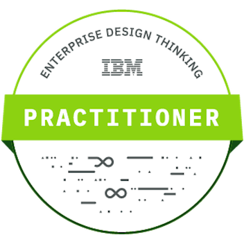
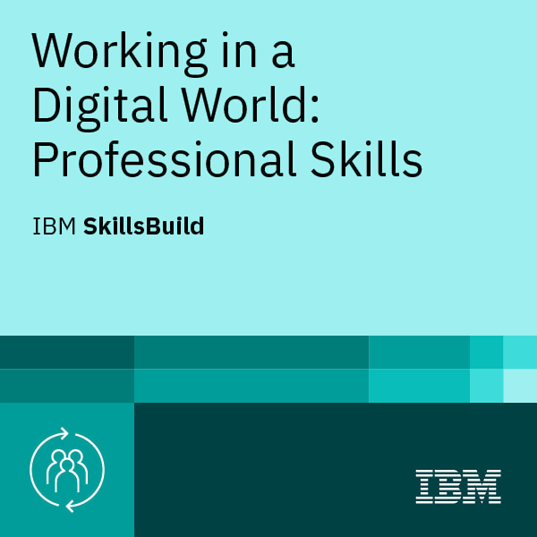

# Hi, I’m Yashwantsingh J. Chauhan 👋

### Software & Data Engineer  
Building scalable **full-stack systems, APIs, databases, and AI/ML-driven solutions**

---

## 👨‍💻 About Me
I’m a Software & Data Engineer with hands-on experience in backend and full-stack development, combined with a strong interest in data analytics, machine learning, and AI. I enjoy solving complex problems, designing scalable systems, and continuously learning new technologies.

---

## 🏢 Current Role
**Software Development Engineer**  
**Revolution Labs Pvt. Ltd.**

- Building scalable APIs and database-driven systems  
- Working across backend and full-stack architectures  
- Contributing to production-grade software solutions  

**Tech I use:**
- Python, FastAPI, REST APIs, MongoDB, PostgreSQL, HTML, CSS, Git, GitHub, Docker, Postman, PuTTY, Ngrok

---

## 🛠️ Tech Stack / Skills

<table width="100%">
  <!-- Header Row -->
  <tr>
    <th align="center">Languages</th>
    <th align="center">Frontend</th>
    <th align="center">Backend</th>
    <th align="center">Databases</th>
    <th align="center" colspan="2">Data / ML</th>
    <th align="center" colspan="2">DevOps / Platforms</th>
    <th align="center">Integrations</th>
  </tr>
  <!-- Content Row -->
  <tr>
    <!-- Languages (4 items) -->
    <td align="center" valign="top">
       Python  
       JavaScript  
       SQL  
       Bash
    </td>
    <!-- Frontend (3 items) -->
    <td align="center" valign="top">
       React  
       HTML  
       CSS
    </td>
    <!-- Backend (3 items) -->
    <td align="center" valign="top">
       Node.js  
       FastAPI  
       REST APIs
    </td>
    <!-- Databases (4 items) -->
    <td align="center" valign="top">
       MongoDB  
       PostgreSQL  
       Oracle  
       MySQL
    </td>
    <!-- Data / ML - Column 1 (5 items) -->
    <td align="center" valign="top">
       Pandas  
       NumPy  
       Matplotlib  
       Scikit-learn  
       OpenCV
    </td>
    <!-- Data / ML - Column 2 (4 items) -->
    <td align="center" valign="top">
       Plotly  
       R  
       NLTK  
       Seaborn
    </td>
    <!-- DevOps / Platforms - Column 1 (5 items) -->
    <td align="center" valign="top">
       Git  
       GitHub  
       Docker  
       Postman  
       Linux
    </td>
    <!-- DevOps / Platforms - Column 2 (2 items) -->
    <td align="center" valign="top">
       Ubuntu  
       PuTTY
    </td>
    <!-- Integrations (3 items) -->
    <td align="center" valign="top">
       Stripe  
       Razorpay  
       Telnyx
    </td>
  </tr>
</table>

---

## 📈 GitHub Stats

---

## 🔥 GitHub Streak

---

## 🧠 Top Languages

---

## 📊 Contribution Activity

<a href="https://github.com/yjchauhan">
  <picture>
    <source media="(prefers-color-scheme: dark)" srcset="https://github-readme-activity-graph.vercel.app/graph?username=yjchauhan&theme=github-compact&hide_border=true&cache_seconds=1800"/>
    <source media="(prefers-color-scheme: light)" srcset="https://github-readme-activity-graph.vercel.app/graph?username=yjchauhan&theme=minimal&hide_border=true&cache_seconds=1800"/>
    
  </picture>
</a>

---

## 🌱 What I’m Currently Learning
- Advanced AI/ML applications  
- Deep Learning  
- System Design  
- Cloud (AWS)

---

## 🏅 Certifications & Achievements

🔗 <strong>My Credly Profile:</strong>
<a href="https://www.credly.com/users/yjchauhan" target="_blank">
<strong>Yashwantsingh J. Chauhan</strong>
</a>

<table width="100%">
  <tr>
    <th align="center">Badge</th>
    <th align="left">Certification</th>
    <th align="left">Issuer</th>
    <th align="left">Description</th>
    <th align="center">View</th>
  </tr>

  <!-- Broadcom -->
  <tr>
    <td align="center">
      
    </td>
    <td><strong>IT Academy: Cloud and Virtualization Concepts</strong></td>
    <td>Broadcom (VMware)</td>
    <td>
      

        Demonstrates knowledge of cloud computing models, virtualization technologies,
        and their application in modern IT infrastructure.
      

    </td>
    <td align="center">
      <a href="https://www.credly.com/badges/6bcde16a-c1e9-4dd2-b9e8-29efbbb058b6/public_url" target="_blank">🔗</a>
    </td>
  </tr>

  <tr>
    <td align="center">
      
    </td>
    <td><strong>IT Academy: Network Virtualization Concepts</strong></td>
    <td>Broadcom (VMware)</td>
    <td>
      

        Validates understanding of virtual networking architectures,
        software-defined networking, and network virtualization principles.
      

    </td>
    <td align="center">
      <a href="https://www.credly.com/badges/bc43805c-bd16-4311-b3be-e89da6a5b50a/public_url" target="_blank">🔗</a>
    </td>
  </tr>

  <tr>
    <td align="center">
      
    </td>
    <td><strong>IT Academy: Software-Defined Storage Concepts</strong></td>
    <td>Broadcom (VMware)</td>
    <td>
      

        Confirms understanding of software-defined storage systems,
        storage virtualization, and modern data management approaches.
      

    </td>
    <td align="center">
      <a href="https://www.credly.com/badges/009099b2-f188-4cd2-9d53-a849b6e12099/public_url" target="_blank">🔗</a>
    </td>
  </tr>

  <!-- Cisco -->
  <tr>
    <td align="center">
      
    </td>
    <td><strong>Introduction to Cybersecurity</strong></td>
    <td>Cisco</td>
    <td>
      

        Establishes foundational understanding of cybersecurity principles,
        cyber threats, vulnerabilities, and defensive strategies.
      

    </td>
    <td align="center">
      <a href="https://www.credly.com/badges/06b3b087-4c4a-4c0c-9314-ea9bcf7a8319/public_url" target="_blank">🔗</a>
    </td>
  </tr>

  <!-- Google -->
  <tr>
    <td align="center">
      
    </td>
    <td><strong>Google Cybersecurity Professional Certificate (V2)</strong></td>
    <td>Google / Coursera</td>
    <td>
      

        Comprehensive training covering cybersecurity fundamentals,
        threat analysis, risk management, and incident response.
      

    </td>
    <td align="center">
      <a href="https://www.credly.com/badges/6f34e83c-7381-4d5b-b13d-df9768de4a23/public_url" target="_blank">🔗</a>
    </td>
  </tr>

  <!-- IBM -->
  <tr>
    <td align="center">
      
    </td>
    <td><strong>Enterprise Design Thinking Practitioner</strong></td>
    <td>IBM</td>
    <td>
      

        Demonstrates the ability to apply human-centered design thinking
        to solve complex business problems through collaboration.
      

    </td>
    <td align="center">
      <a href="https://www.credly.com/badges/f9085005-215a-4af6-ab2a-c11e9e82cb35/public_url" target="_blank">🔗</a>
    </td>
  </tr>

  <!-- IBM SkillsBuild -->
  <tr>
    <td align="center">
      
    </td>
    <td><strong>Working in a Digital World: Professional Skills</strong></td>
    <td>IBM SkillsBuild</td>
    <td>
      

        Highlights essential workplace skills including communication,
        collaboration, adaptability, and digital professionalism.
      

    </td>
    <td align="center">
      <a href="https://www.credly.com/badges/cd25bd54-7fae-4c5a-b718-4b4ca61c256a/public_url" target="_blank">🔗</a>
    </td>
  </tr>

</table>

---

## 🎯 Open to Opportunities
- Software / Backend Engineer  
- Full Stack Developer  
- Data Scientist / Analyst  
- ML / AI Engineer  

---

## 📬 Connect With Me

<table width="92%">
  <tr>
    <!-- Email -->
    <td align="center" width="16.66%">
      <a href="mailto:ysingh.chauhan2002@gmail.com">
         
        <b>Email</b>
      </a>
    </td>
    <!-- LinkedIn -->
    <td align="center" width="16.66%">
      <a href="https://www.linkedin.com/in/yjchauhan" target="_blank">
         
        <b>LinkedIn</b>
      </a>
    </td>
    <!-- Twitter / X -->
    <td align="center" width="16.66%">
      <a href="https://twitter.com/yjchauhan6322" target="_blank">
         
        <b>X&nbsp;(Twitter)</b>
      </a>
    </td>
    <!-- Instagram -->
    <td align="center" width="16.66%">
      <a href="https://instagram.com/king_panda_6322" target="_blank">
         
        <b>Instagram</b>
      </a>
    </td>
    <!-- Phone (WhatsApp) -->
    <td align="center" width="16.66%">
      <a href="https://wa.me/919408915397" target="_blank">
         
        <b>WhatsApp</b>
      </a>
    </td>
    <!-- YouTube -->
    <td align="center" width="16.66%">
      <a href="https://www.youtube.com/@2kingpanda2" target="_blank">
         
        <b>YouTube</b>
      </a>
    </td>
  </tr>
</table>

---

## 💬 Ask Me About

- Designing and building **scalable backend APIs** using FastAPI and REST architectures  
- **Database design, optimization, and aggregations** with MongoDB and PostgreSQL  
- Developing **end-to-end full-stack applications** with clean and maintainable code  
- Applying **data analytics and machine learning** to solve real-world business problems  
- Best practices for **system design, performance, and production-ready software**

---

## 🎉 Fun Facts

<pre>
🐼  Spirit Animal     :  King Panda

☕  Debugging Mode    :  Best After Midnight

🧩  Superpower        :  Turning Coffee into Code

🎯  Life Motto        :  "Build without boundaries, debug without fear"

😄  Plot Twist        :  I fix bugs that haven’t been reported yet!
</pre>

---

## 👀 Profile Insights

 

&nbsp;&nbsp;&nbsp;

&nbsp;&nbsp;&nbsp;

