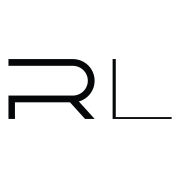
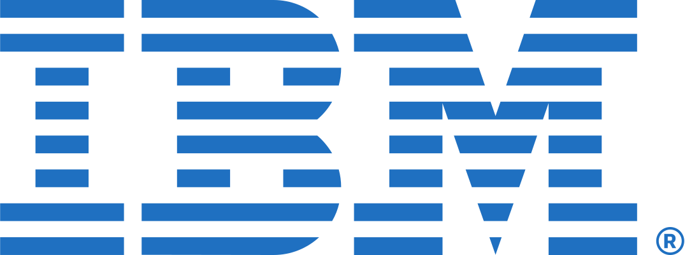
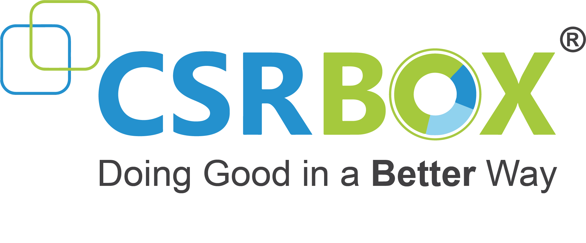
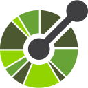
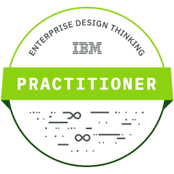
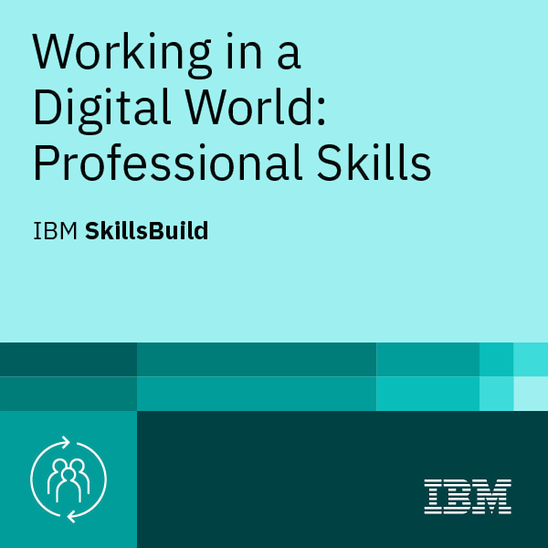

# Hi, I'm Yashwantsingh J. Chauhan 

 

---

##  About Me

I live at the intersection of **AI, data, and product**. Train the model. Move the data. Ship the system. Every problem is a workshop project - prototype it tonight, measure it tomorrow, ship it before someone else thinks of it. Then build the next one.

**I build the suit, I deploy the suit, I own the suit.** The infrastructure under my work runs on my hands, not someone else's invoice.

**Day job:** building production backends real customers depend on.  
**Off-hours:** founder-in-training, betting on AI/ML experiments, data tools, SaaS plays - and an operating system of my own. Different clocks, same rule. The workshop never closes.

<table width="100%">
  <tr>
    <td align="center" valign="top" width="25%">
       
      <strong>AI & Machine Learning</strong> 
      Training, fine-tuning, and inventing models that earn their place in the suit.
    </td>
    <td align="center" valign="top" width="25%">
       
      <strong>Data Science Lab</strong> 
      Raw data in. Insights, dashboards, and decisions that actually move the needle out.
    </td>
    <td align="center" valign="top" width="25%">
       
      <strong>Data Engineering</strong> 
      Pipelines, databases, APIs - the arc reactor for everything that runs on top.
    </td>
    <td align="center" valign="top" width="25%">
       
      <strong>Founder & Inventor</strong> 
      A company. An operating system. Idea Monday, prototype Friday, live before anyone asks for permission.
    </td>
  </tr>
</table>

---

##  Current Role
**Associate Software Engineer**  
**Revoltution Labs Pvt. Ltd.**

- Designing and shipping scalable APIs and database-driven systems  
- Working across backend and full-stack architectures  
- Contributing to production-grade software customers actually use  

**Tech I use day-to-day:**
- Python | FastAPI | REST APIs | MongoDB | PostgreSQL | Git | GitHub | Docker | Postman | PuTTY | Ngrok

---

##  Worked With

<table>
  <thead>
    <tr>
      <th align="center" width="22%">Company</th>
      <th align="left" width="22%">Role</th>
      <th align="center" width="14%">Period</th>
      <th align="left" width="42%">What I Shipped</th>
    </tr>
  </thead>
  <tbody>
    <tr>
      <td align="center" valign="top">
         
        <strong>Revoltution Labs</strong> 
        Bengaluru, India
      </td>
      <td valign="top">
        <strong>Associate Software Engineer</strong> - current 
        Promoted from Trainee SE
      </td>
      <td align="center" valign="top">
        Mar 2025 - Present 
        1 yr 2 mos
      </td>
      <td valign="top">
        Lead backend feature delivery across scalable APIs and database-driven services. Drive architecture decisions for production systems and review code from peers. Mentor incoming engineers and own cross-team integrations end-to-end.
          
        <strong>Stack:</strong> Python | FastAPI | MongoDB | PostgreSQL | Docker | Git | REST APIs
      </td>
    </tr>
    <tr>
      <td align="center" valign="top">
        
         
        <strong>IBM SkillsBuild with CSRBOX</strong>
      </td>
      <td valign="top">
        <strong>Data Science Intern</strong>
      </td>
      <td align="center" valign="top">
        Feb 2024 - Mar 2024
      </td>
      <td valign="top">
        Completed self-paced learning plus live masterclasses. Delivered assignments and case-study analyses in R, focused on statistical tests and applied data analysis.
          
        <strong>Stack:</strong> R | Data Analysis | Statistical Tests
      </td>
    </tr>
    <tr>
      <td align="center" valign="top">
         
        <strong>MotionCut</strong>
      </td>
      <td valign="top">
        <strong>Web Development Intern</strong>
      </td>
      <td align="center" valign="top">
        Sep 2023 - Oct 2023
      </td>
      <td valign="top">
        Built multiple web projects: websites, a To-Do app, a portfolio site, and an interactive E-Commerce experience.
          
        <strong>Stack:</strong> HTML | CSS | JavaScript
      </td>
    </tr>
    <tr>
      <td align="center" valign="top">
         
        <strong>Open Weaver Inc.</strong>
      </td>
      <td valign="top">
        <strong>Data Science Intern</strong>
      </td>
      <td align="center" valign="top">
        Aug 2023 - Sep 2023
      </td>
      <td valign="top">
        Built the Resume Description Generator capstone project independently. Progressed from explorer to practitioner across the IBM curriculum.
          
        <strong>Stack:</strong> Python | Machine Learning | NLP
      </td>
    </tr>
  </tbody>
</table>

---

##  Tech Stack / Skills

<table width="100%">
  <!-- Header Row -->
  <tr>
    <th align="center">Languages</th>
    <th align="center">Frontend</th>
    <th align="center">Backend</th>
    <th align="center">Databases</th>
    <th align="center" colspan="2">Data / ML</th>
    <th align="center" colspan="2">DevOps / Platforms</th>
    <th align="center">Integrations</th>
  </tr>
  <!-- Content Row -->
  <tr>
    <!-- Languages (4 items - alphabetical) -->
    <td align="center" valign="top">
       Bash  
       JavaScript  
       Python  
       SQL
    </td>
    <!-- Frontend (6 items - alphabetical) -->
    <td align="center" valign="top">
       CSS  
       HTML  
       Next.js  
       React  
       Tailwind CSS  
       Three.js
    </td>
    <!-- Backend (4 items - alphabetical) -->
    <td align="center" valign="top">
       Express.js  
       FastAPI  
       Node.js  
       REST APIs
    </td>
    <!-- Databases (5 items - alphabetical) -->
    <td align="center" valign="top">
       MongoDB  
       MySQL  
       Oracle  
       PostgreSQL  
       Redis
    </td>
    <!-- Data / ML - Column 1 (5 items - alphabetical) -->
    <td align="center" valign="top">
       Matplotlib  
       NLTK  
       NumPy  
       OpenCV  
       Pandas
    </td>
    <!-- Data / ML - Column 2 (4 items - alphabetical) -->
    <td align="center" valign="top">
       Plotly  
       R  
       Scikit-learn  
       Seaborn
    </td>
    <!-- DevOps / Platforms - Column 1 (7 items - alphabetical) -->
    <td align="center" valign="top">
       Cloudflare  
       Docker  
       Git  
       GitHub  
       Kubernetes  
       Linux  
       Neon
    </td>
    <!-- DevOps / Platforms - Column 2 (6 items - alphabetical) -->
    <td align="center" valign="top">
       Ngrok  
       Postman  
       PuTTY  
       Render  
       Ubuntu  
       Vercel
    </td>
    <!-- Integrations (3 items - alphabetical) -->
    <td align="center" valign="top">
       Razorpay  
       Stripe  
       Telnyx
    </td>
  </tr>
</table>

---

##  GitHub Stats

<a href="https://github.com/yjchauhan">
  <picture>
    <source media="(prefers-color-scheme: dark)" srcset="https://github-stats-cards-eight.vercel.app/api/stats?username=yjchauhan&theme=tokyo-night&show_icons=true&include_all_commits=true&count_private=true&show=reviews%2Cprs_merged%2Cprs_merged_percentage&hide_border=true"/>
    <source media="(prefers-color-scheme: light)" srcset="https://github-stats-cards-eight.vercel.app/api/stats?username=yjchauhan&theme=lavender-masculine&show_icons=true&include_all_commits=true&count_private=true&show=reviews%2Cprs_merged%2Cprs_merged_percentage&hide_border=true"/>
    
  </picture>
</a>

---

##  GitHub Streak

<a href="https://github.com/yjchauhan">
  <picture>
    <source media="(prefers-color-scheme: dark)" srcset="https://github-stats-cards-eight.vercel.app/api/streak?username=yjchauhan&theme=tokyo-night&hide_border=true"/>
    <source media="(prefers-color-scheme: light)" srcset="https://github-stats-cards-eight.vercel.app/api/streak?username=yjchauhan&theme=lavender-masculine&hide_border=true"/>
    
  </picture>
</a>

---

##  Top Languages

<a href="https://github.com/yjchauhan">
  <picture>
    <source media="(prefers-color-scheme: dark)" srcset="https://github-stats-cards-eight.vercel.app/api/languages?username=yjchauhan&theme=tokyo-night&layout=donut&langs_count=12&hide_border=true"/>
    <source media="(prefers-color-scheme: light)" srcset="https://github-stats-cards-eight.vercel.app/api/languages?username=yjchauhan&theme=lavender-masculine&layout=donut&langs_count=12&hide_border=true"/>
    
  </picture>
</a>

---

##  Contribution Activity

<a href="https://github.com/yjchauhan">
  <picture>
    <source media="(prefers-color-scheme: dark)" srcset="https://github-stats-cards-eight.vercel.app/api/contributions?username=yjchauhan&theme=tokyo-night&hide_border=true"/>
    <source media="(prefers-color-scheme: light)" srcset="https://github-stats-cards-eight.vercel.app/api/contributions?username=yjchauhan&theme=lavender-masculine&hide_border=true"/>
    
  </picture>
</a>

---

##  Contributions, Eaten by a Snake

<picture>
  <source media="(prefers-color-scheme: dark)" srcset="https://raw.githubusercontent.com/yjchauhan/yjchauhan/output/github-snake-dark.svg"/>
  <source media="(prefers-color-scheme: light)" srcset="https://raw.githubusercontent.com/yjchauhan/yjchauhan/output/github-snake.svg"/>
  
</picture>

---

##  Certifications & Achievements

<strong>Credly Profile:</strong>
<a href="https://www.credly.com/users/yjchauhan" target="_blank">
<strong>Yashwantsingh J. Chauhan</strong>
</a>

<table width="100%">
  <tr>
    <th align="center">Badge</th>
    <th align="left">Certification</th>
    <th align="left">Issuer</th>
    <th align="left">Description</th>
    <th align="center">View</th>
  </tr>

  <!-- Broadcom -->
  <tr>
    <td align="center">
      
    </td>
    <td><strong>IT Academy: Cloud and Virtualization Concepts</strong></td>
    <td>Broadcom (VMware)</td>
    <td>
      

        Demonstrates knowledge of cloud computing models, virtualization technologies,
        and their application in modern IT infrastructure.
      

    </td>
    <td align="center">
      <a href="https://www.credly.com/badges/6bcde16a-c1e9-4dd2-b9e8-29efbbb058b6/public_url" target="_blank"><strong>View</strong></a>
    </td>
  </tr>

  <tr>
    <td align="center">
      
    </td>
    <td><strong>IT Academy: Network Virtualization Concepts</strong></td>
    <td>Broadcom (VMware)</td>
    <td>
      

        Validates understanding of virtual networking architectures,
        software-defined networking, and network virtualization principles.
      

    </td>
    <td align="center">
      <a href="https://www.credly.com/badges/bc43805c-bd16-4311-b3be-e89da6a5b50a/public_url" target="_blank"><strong>View</strong></a>
    </td>
  </tr>

  <tr>
    <td align="center">
      
    </td>
    <td><strong>IT Academy: Software-Defined Storage Concepts</strong></td>
    <td>Broadcom (VMware)</td>
    <td>
      

        Confirms understanding of software-defined storage systems,
        storage virtualization, and modern data management approaches.
      

    </td>
    <td align="center">
      <a href="https://www.credly.com/badges/009099b2-f188-4cd2-9d53-a849b6e12099/public_url" target="_blank"><strong>View</strong></a>
    </td>
  </tr>

  <!-- Cisco -->
  <tr>
    <td align="center">
      
    </td>
    <td><strong>Introduction to Cybersecurity</strong></td>
    <td>Cisco</td>
    <td>
      

        Establishes foundational understanding of cybersecurity principles,
        cyber threats, vulnerabilities, and defensive strategies.
      

    </td>
    <td align="center">
      <a href="https://www.credly.com/badges/06b3b087-4c4a-4c0c-9314-ea9bcf7a8319/public_url" target="_blank"><strong>View</strong></a>
    </td>
  </tr>

  <!-- Google -->
  <tr>
    <td align="center">
      
    </td>
    <td><strong>Google Cybersecurity Professional Certificate (V2)</strong></td>
    <td>Google / Coursera</td>
    <td>
      

        Comprehensive training covering cybersecurity fundamentals,
        threat analysis, risk management, and incident response.
      

    </td>
    <td align="center">
      <a href="https://www.credly.com/badges/6f34e83c-7381-4d5b-b13d-df9768de4a23/public_url" target="_blank"><strong>View</strong></a>
    </td>
  </tr>

  <!-- IBM -->
  <tr>
    <td align="center">
      
    </td>
    <td><strong>Enterprise Design Thinking Practitioner</strong></td>
    <td>IBM</td>
    <td>
      

        Demonstrates the ability to apply human-centered design thinking
        to solve complex business problems through collaboration.
      

    </td>
    <td align="center">
      <a href="https://www.credly.com/badges/f9085005-215a-4af6-ab2a-c11e9e82cb35/public_url" target="_blank"><strong>View</strong></a>
    </td>
  </tr>

  <!-- IBM SkillsBuild -->
  <tr>
    <td align="center">
      
    </td>
    <td><strong>Working in a Digital World: Professional Skills</strong></td>
    <td>IBM SkillsBuild</td>
    <td>
      

        Highlights essential workplace skills including communication,
        collaboration, adaptability, and digital professionalism.
      

    </td>
    <td align="center">
      <a href="https://www.credly.com/badges/cd25bd54-7fae-4c5a-b718-4b4ca61c256a/public_url" target="_blank"><strong>View</strong></a>
    </td>
  </tr>

</table>

---

##  Open to Opportunities

- **AI / ML Engineer** - train, fine-tune, and ship models that earn their slot in production. Inference layer included.
- **Data Scientist / Data Engineer** - raw data in, decisions that move the number out.
- **Founding Engineer** - zero-to-one builds. Idea Monday, live customer Friday.
- **Backend / Full-Stack Engineer** - APIs and systems that survive scale, not just demo day.
- **Inventor / Builder** - bring the constraint. I bring the prototype, and the deploy pipeline behind it.

---

##  Connect With Me

<table width="92%">
  <tr>
    <!-- Email -->
    <td align="center" width="16.66%">
      <a href="mailto:ysingh.chauhan2002@gmail.com">
         
        <b>Email</b>
      </a>
    </td>
    <!-- LinkedIn -->
    <td align="center" width="16.66%">
      <a href="https://www.linkedin.com/in/yjchauhan" target="_blank">
         
        <b>LinkedIn</b>
      </a>
    </td>
    <!-- Twitter / X -->
    <td align="center" width="16.66%">
      <a href="https://twitter.com/yjchauhan6322" target="_blank">
         
        <b>X&nbsp;(Twitter)</b>
      </a>
    </td>
    <!-- Instagram -->
    <td align="center" width="16.66%">
      <a href="https://instagram.com/king_panda_6322" target="_blank">
         
        <b>Instagram</b>
      </a>
    </td>
    <!-- Phone (WhatsApp) -->
    <td align="center" width="16.66%">
      <a href="https://wa.me/919408915397" target="_blank">
         
        <b>WhatsApp</b>
      </a>
    </td>
    <!-- YouTube -->
    <td align="center" width="16.66%">
      <a href="https://www.youtube.com/@2kingpanda2" target="_blank">
         
        <b>YouTube</b>
      </a>
    </td>
  </tr>
</table>

---

##  Ask Me About

- **Training and fine-tuning ML models** that actually ship to production  
- **Designing data pipelines** that turn raw input into decisions that move the needle  
- Building **scalable backend APIs** with FastAPI, REST architectures, and clean data layers  
- **Database design, optimization, and aggregations** across MongoDB and PostgreSQL  
- Taking an idea from **prototype on Monday** to **live customer on Friday**  
- The economics of **shipping fast while keeping production-grade quality**  
- What it actually takes to **build a company and an operating system on the side**

---

##  Fun Facts

<table>
  <tr><td><strong>Spirit Animal</strong></td><td>King Panda</td></tr>
  <tr><td><strong>Debugging Mode</strong></td><td>Best After Midnight</td></tr>
  <tr><td><strong>Superpower</strong></td><td>Turning Coffee into Code</td></tr>
  <tr><td><strong>Life Motto</strong></td><td>"Build without boundaries, debug without fear"</td></tr>
  <tr><td><strong>Plot Twist</strong></td><td>I fix bugs that haven't been reported yet</td></tr>
</table>

---

##  Profile Insights

 

<a href="https://github.com/yjchauhan">
  <picture>
    <source media="(prefers-color-scheme: dark)" srcset="https://github-stats-cards-eight.vercel.app/api/insights?username=yjchauhan&theme=tokyo-night&hide_border=true"/>
    <source media="(prefers-color-scheme: light)" srcset="https://github-stats-cards-eight.vercel.app/api/insights?username=yjchauhan&theme=lavender-masculine&hide_border=true"/>
    
  </picture>
</a>

